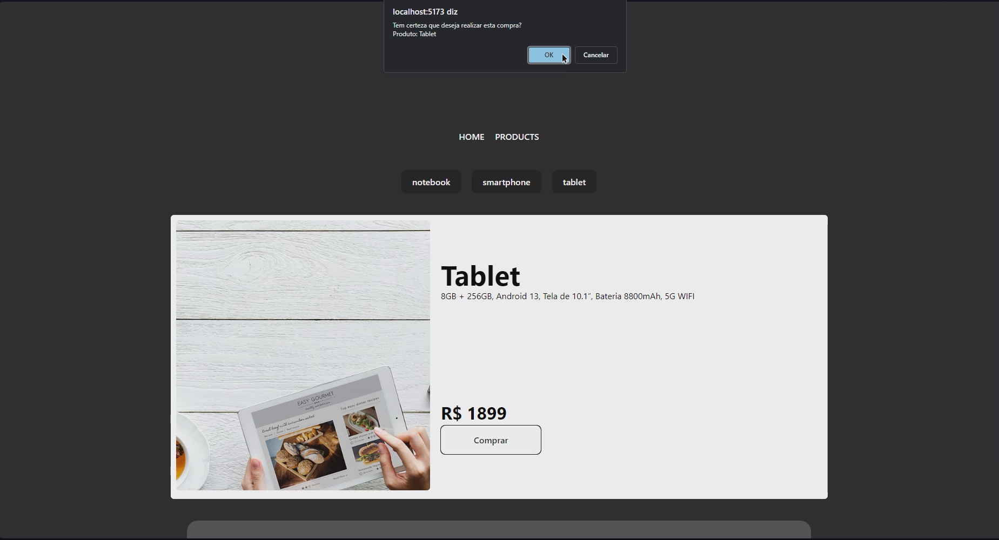

# A project made with React + VITE

This template provides a minimal setup to get React working in Vite with HMR and some ESLint rules.

Currently, two official plugins are available:

- [@vitejs/plugin-react](https://github.com/vitejs/vite-plugin-react/blob/main/packages/plugin-react/README.md) uses [Babel](https://babeljs.io/) for Fast Refresh
- [@vitejs/plugin-react-swc](https://github.com/vitejs/vite-plugin-react-swc) uses [SWC](https://swc.rs/) for Fast Refresh


# How to start

Clone this repository in your Visual Studio Code:
```
git clone https://github.com/pablo-eduardo-dev/e-commerce-entre-aspas.git
```

<br>

Than go into on person-page folder and install the dependecies to run: <br>
```
cd e-commerce-entre-aspas
npm install
npm run dev
```

## About project

In this project, i used requests and hooks to create an e-commerce simulator.


